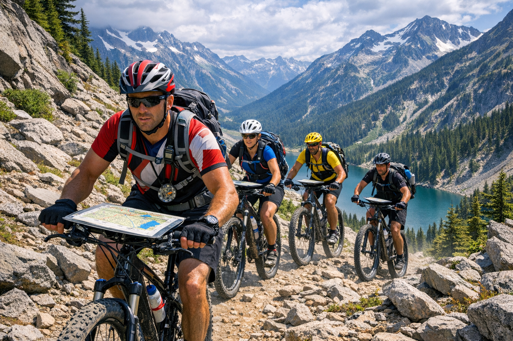

# Introduction to Adventure Racing

Adventure racing is a thrilling multidisciplinary endurance sport that combines outdoor navigation with physical challenges across varied terrain. Teams (or sometimes individuals) race through unmarked wilderness courses, using only a map and compass to find designated checkpoints. It's part outdoor race, part scavenger hunt, and part team survival challenge—blending fitness, strategy, navigation skills, and adaptability.

Unlike traditional running or biking races where you follow a marked route, adventure racing requires you to plan your own path. Teams make strategic decisions about which checkpoints to visit and how to connect them, navigating through forests, across rivers, and over mountains while managing limited time and energy.

> [!WARNING]
> Adventure racing can be intense fun.

 

## Core Race Disciplines

Adventure races typically combine three core disciplines, though some events add additional challenges:

- **Trekking/Trail Running**: On-trail and off-trail foot navigation, including bushwhacking through unmarked terrain and managing elevation changes
- **Mountain Biking**: Riding on dirt roads, gravel paths, and technical singletrack trails
- **Paddling**: Using canoes, kayaks, or packrafts on lakes, rivers, and sometimes open water

### Additional Disciplines
Some races include:
- Rope work (climbing, rappelling)
- Swimming or wading sections
- Orienteering challenges
- Special team challenges
- Inline skating (less common)

 

## Checkpoint Navigation
At race start, teams receive a map showing checkpoint locations (called "CPs"). Each CP typically has:
- A specific coordinate location
- A point value
- A physical marker (usually a punch or flag) to prove you found it

### Route Choice
Unlike marked trails, you decide how to travel between checkpoints. This requires:
- Reading topographic maps
- Using a compass for bearings
- Identifying terrain features
- Making strategic decisions about the fastest or safest route
- Constant communication with teammates

### Important Rules

**Stay Together**: All team members must complete the course together, typically remaining within sight or a specified distance (often 100 meters) of each other at all times. This is not a relay—the entire team finishes together.

**Unsupported Racing**: Teams cannot receive outside assistance between transition areas. You must be self-sufficient on each leg.

**Time Cutoffs**: Most races have a maximum time limit. Teams that exceed the cutoff may be disqualified or scored only for CPs collected before the deadline.

**Gear Checks**: Race directors conduct gear checks before the race. Missing mandatory items can result in penalties, time additions, or disqualification.

**No Outside Navigation Aids**: GPS navigation devices are typically prohibited (except race-provided safety trackers). You must navigate using map and compass.

 

## What Makes Adventure Racing Special

Adventure racing is unique because:
- **It's truly a team sport**: You succeed or fail together
- **Navigation skills matter as much as fitness**: The strongest team doesn't always win
- **Every race is different**: Different terrain, weather, and challenges make each event unique
- **It builds problem-solving skills**: You'll face unexpected challenges and learn to adapt
- **It's accessible to beginners**: Sprint races welcome newcomers and provide a supportive community

Whether you're an experienced endurance athlete looking for a new challenge or someone seeking an outdoor adventure with friends, adventure racing offers an exciting blend of physical challenge, mental engagement, and teamwork that few other sports can match.

---

Ready to dive deeper? Explore specific topics:
- [Race Formats](/content/race-formats.md) - Common race lengths and checkpoint styles
- [Navigation](/content/navigation.md) - Master map and compass skills
- [Gear](/content/gear.md) - What equipment you'll need
- [Trekking](/content/trekking.md) - On-foot travel strategies
- [Biking](/content/biking.md) - Mountain biking in races
- [Paddling](/content/paddling.md) - Water sections guide
- [Nutrition](/content/nutrition.md) - Fueling for endurance
- [Team Dynamics](/content/team-dynamics.md) - Working together effectively
- [Transition Areas](/content/transition-areas.md) - Efficient gear changes
